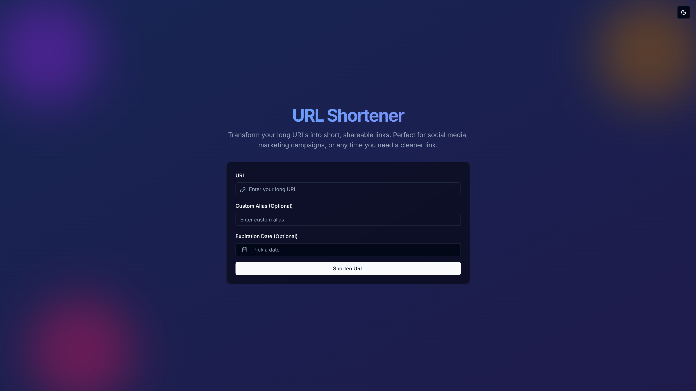
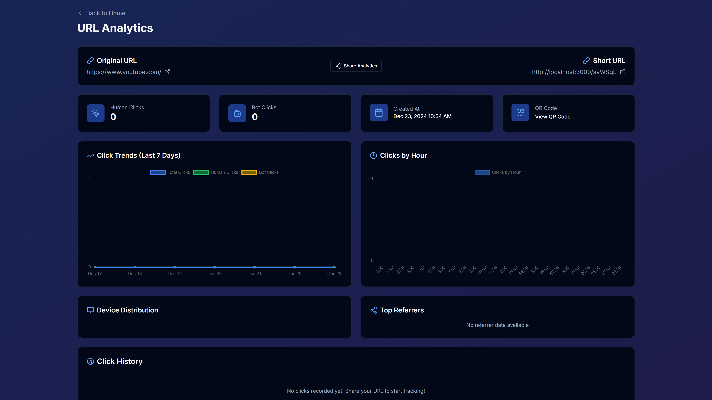

# Modern URL Shortener

A modern, full-stack URL shortener built with Next.js 15, MongoDB, and Shadcn UI. Create short, memorable links with advanced features like custom aliases, expiration dates, and detailed analytics.


## Screenshots

### Homepage


### Analytics Dashboard


## Features

- 🚀 Modern, responsive UI with dark mode support
- 🔗 Generate short URLs instantly
- 🎯 Custom alias support
- ⏰ URL expiration dates
- 📊 Detailed analytics with charts and graphs
- 🌐 Device and location tracking
- 📱 Mobile-first, responsive design
- 🌙 Dark/Light mode with system preference support
- 📈 Click tracking with bot detection
- 🔍 Referrer and UTM parameter tracking
- 📱 QR code generation for shortened URLs
- 📊 Interactive charts for click trends
- 🕒 Hourly and daily click distribution
- 🌍 Geographic location insights
- 🔄 Real-time analytics updates

## Tech Stack

### Frontend
- **Next.js 15** - React framework with App Router
- **React 19** - JavaScript library for user interfaces
- **TypeScript** - Type safety and better developer experience
- **Tailwind CSS** - Utility-first CSS framework
- **Shadcn UI** - High-quality, accessible UI components
- **Chart.js 4.4** - Interactive charts and graphs
- **React Hook Form 7.54** - Form validation and handling
- **Zod 3.24** - Schema validation
- **Lucide React 0.469** - Beautiful, consistent icons
- **next-themes 0.4** - Theme management

### Backend
- **MongoDB 8.9** - Document database
- **Mongoose** - MongoDB object modeling
- **Next.js API Routes** - Serverless API endpoints
- **nanoid 5.0** - URL shortcode generation

### Development Tools
- **TypeScript 5.7** - Static type checking
- **ESLint** - Code linting
- **Prettier** - Code formatting
- **Turbopack** - Incremental bundler

## Getting Started

### Prerequisites
- Node.js 18+ 
- MongoDB database

### Installation

1. Clone the repository:
```bash
git clone https://github.com/byigitt/short.git
cd short
```

2. Install dependencies:
```bash
npm install
# or
yarn install
# or
pnpm install
```

3. Create a `.env.local` file in the root directory:
```env
MONGODB_URI=your_mongodb_connection_string
NEXT_PUBLIC_APP_URL=http://localhost:3000
```

4. Run the development server:
```bash
npm run dev
# or
yarn dev
# or
pnpm dev
```

5. Open [http://localhost:3000](http://localhost:3000) in your browser.

## Project Structure

```
├── app/                    # Next.js App Router
│   ├── api/               # API routes
│   ├── [shortCode]/      # URL redirection
│   ├── a/                # Analytics pages
│   ├── layout.tsx        # Root layout
│   └── page.tsx          # Home page
├── components/           # React components
│   ├── ui/              # Shadcn UI components
│   └── theme/           # Theme components
├── lib/                 # Shared utilities
│   ├── db.ts           # Database connection
│   ├── models/         # Mongoose models
│   ├── validations/    # Zod schemas
│   └── utils/          # Utility functions
└── public/             # Static files
```

## Features in Detail

### URL Shortening
- Generate short codes using nanoid
- Support for custom aliases
- URL validation and sanitization
- Expiration date setting
- Duplicate URL detection
- Reserved keyword protection

### Analytics
- Click tracking with bot detection
- Device and browser detection
- Geographic location tracking
- Referrer tracking
- UTM parameter tracking
- Time-based analytics
- Interactive charts and graphs
- QR code generation

### User Experience
- Mobile-first responsive design
- Dark mode support
- Copy to clipboard functionality
- QR code sharing
- Loading states and animations
- Toast notifications
- Form validation
- Error handling

## API Endpoints

### POST /api/url
Create a new short URL
- Body: `{ url: string, customAlias?: string, expiresAt?: string }`
- Response: `{ shortCode: string, shortUrl: string, analyticsUrl: string }`

### GET /[shortCode]
Redirect to original URL
- Params: shortCode
- Response: 301 redirect or 404

### GET /api/analytics/[shortCode]
Get URL analytics
- Params: shortCode
- Response: Analytics data with clicks and stats

## Contributing

1. Fork the repository
2. Create your feature branch: `git checkout -b feature/amazing-feature`
3. Commit your changes: `git commit -m 'Add amazing feature'`
4. Push to the branch: `git push origin feature/amazing-feature`
5. Open a Pull Request

## License

This project is licensed under the MIT License - see the [LICENSE](LICENSE) file for details.

## Acknowledgments

- [Next.js](https://nextjs.org/)
- [Shadcn UI](https://ui.shadcn.com/)
- [Tailwind CSS](https://tailwindcss.com/)
- [MongoDB](https://www.mongodb.com/)
- [Chart.js](https://www.chartjs.org/)
